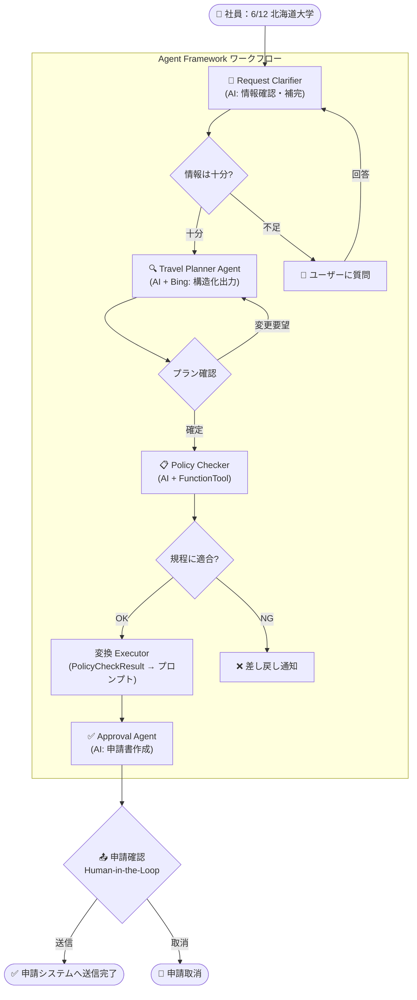
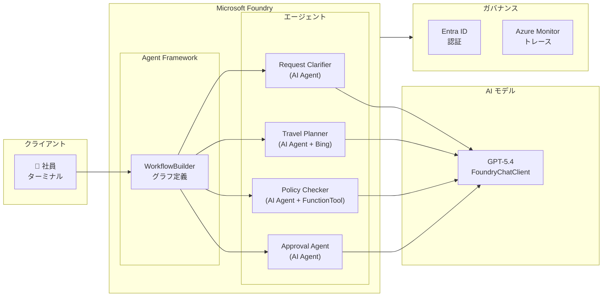

# Microsoft Foundryで構築するAIエージェント開発最前線 — デモシナリオ

## デモ概要

**シナリオ: AI 出張申請エージェント**

社員が「6/12 北海道大学」のように自然言語で伝えるだけで、情報の確認・補完から交通手段・宿泊の検索、社内規程チェック、申請書作成・送信までを一気通貫で処理するワークフロー型マルチエージェントシステムです。

### なぜこのシナリオか

| 観点 | 説明 |
|------|------|
| **誰でもわかる** | 出張申請は多くの企業に共通する業務。聴衆全員がイメージしやすい |
| **マルチエージェントの必然性** | 情報確認・検索・規程チェック・申請書作成と異なる専門性が必要で、役割分担が自然 |
| **Foundry の機能を網羅** | Agent Framework・Structured Output・Human-in-the-Loop をコンパクトに紹介 |
| **デモがシンプル** | 入力 → 確認 → 検索 → チェック → 申請の流れが明快で、短時間でデモ可能 |

---

## 実装バージョン

| ファイル | 説明 | 使用ライブラリ |
|---------|------|---------------|
| `src/workflow.py` | **対話型 CLI 版** | `agent-framework>=1.0.0` |
| `src/hosted.py` | **ホステッドエージェント版** | `azure-ai-agentserver-agentframework` |
| `src/build_agents.py` | Foundry Agent ビルドスクリプト | `azure-ai-projects==2.0.1` |

### Agent Framework 版の特徴

- **グラフベースのワークフロー**: `WorkflowBuilder` による宣言的なエージェント接続
- **対話ループ**: 情報不足時の確認ループ、プラン変更要望による再検索ループ
- **条件分岐エッジ**: 旅費規程チェック結果で自動ルーティング（OK → 申請書作成 / NG → 差し戻し）
- **構造化出力**: Pydantic モデルで型安全なエージェント間データ受け渡し
- **AI + 決定論ロジックの混在**: Travel Planner（AI）→ Policy Checker（ルールエンジン）→ Approval（AI）

---

## エージェント構成

**4 つの専門エージェント + カスタム Executor** によるワークフロー構成です。

| # | ノード名 | 種別 | 役割 |
|---|---------|------|------|
| 0 | **Request Clarifier Agent** | AI Agent | リクエスト情報の確認・補完（不足時はユーザーに質問） |
| 1 | **Travel Planner Agent** | AI Agent + Bing | 交通手段・宿泊先を検索・提案（構造化 JSON 出力） |
| 2 | **Policy Checker** | AI Agent + FunctionTool | 社内旅費規程との適合判定（決定論的ルール） |
| 3 | **Approval Agent** | AI Agent | 出張申請書を作成 |

### Travel Planner の構造化出力

```json
{
  "trip_type": "日帰り / 宿泊",
  "transportation_legs": [
    {"method": "新幹線のぞみ 普通車指定席", "from": "東京", "to": "新大阪", "cost": 14720},
    {"method": "新幹線のぞみ 普通車指定席", "from": "新大阪", "to": "東京", "cost": 14720}
  ],
  "transportation_cost": 29440,
  "hotel": "東横INN 大阪本町",
  "hotel_cost_per_night": 8500,
  "hotel_nights": 1,
  "schedule": "4/5 前泊 → 4/6 訪問 → 当日帰京",
  "total_cost": 40440,
  "distance_km": 515,
  "travel_time_hours": 2.5
}
```

- 日程が 1 日 → `trip_type: "日帰り"`（hotel 系フィールドは null）
- 日程が期間 → `trip_type: "宿泊"`

---

## ワークフロー図



---

## デモの流れ（ライブデモ手順）

### Step 1: 環境紹介（1 分）
- Microsoft Foundry ポータルを開き、プロジェクト構成を紹介
- Agent Framework のワークフローグラフ構造を説明

### Step 2: 出張リクエスト & 情報確認（1 分）
- ターミナルで `python src/workflow.py` を実行
- 「6/12 北海道大学」のように簡潔に入力
- Request Clarifier が情報を整理し、不足があればユーザーに質問

### Step 3: 旅程提案 & プラン確認（2 分）
- Travel Planner Agent が Bing Grounding で交通手段・宿泊先を検索・提案
- **構造化出力** で `trip_type`（日帰り/宿泊）・交通手段（区間ごと）・宿泊先を JSON 出力
- ユーザーがプランを確認し、変更要望があればチャットで入力 → 再検索

### Step 4: 規程チェック（2 分）
- Policy Checker（FunctionTool）が旅費規程をチェック
- 「宿泊費 ¥8,500 は上限 ¥12,000 以内 → ✅」のように判定
- **条件分岐エッジ** で OK/NG を自動ルーティング

### Step 5: 申請確認（2 分）
- Approval Agent が正式な出張申請書を自動作成
- **Human-in-the-Loop** で申請者本人が内容を確認し、申請システムへ送信

---

## 実行方法

### 前提条件
- Python 3.12+
- Azure CLI (`az login` 済み)
- Azure Foundry プロジェクト

### セットアップ

```bash
# 1. Azure インフラのデプロイ
bash deploy.sh

# 2. 依存パッケージのインストール
pip install -r requirements.txt

# 3. .env ファイルの確認
cat .env
```

### 実行

```bash
# ローカル実行（対話型 CLI）
python src/workflow.py
```

### ホステッドエージェントとしてデプロイ

ワークフローを Foundry Agent Service のホステッドエージェントとしてデプロイできます。
ホステッド版（`src/hosted.py`）は非対話型で、HTTP API 経由でリクエストを受け付けます。

#### ローカルテスト

```bash
# ホステッドエージェントをローカルで起動（localhost:8088）
python src/hosted.py
```

```bash
# 別ターミナルからリクエスト
curl -sS -X POST http://localhost:8088/responses \
  -H "Content-Type: application/json" \
  -d '{"input": "6/12 北海道大学", "stream": false}'
```

#### デプロイ手順

```bash
# 1. Docker イメージをビルド（linux/amd64 必須）
az acr build --registry <YOUR_ACR> --platform linux/amd64 --image travel-request-agent:latest .

# 2. サブエージェントをビルド
python src/build_agents.py

# 3. ホステッドエージェントを登録
python src/build_agents.py --deploy
```

#### ホステッドエージェントの呼び出し

```python
from azure.identity import DefaultAzureCredential
from azure.ai.projects import AIProjectClient

client = AIProjectClient(
    endpoint="<PROJECT_ENDPOINT>",
    credential=DefaultAzureCredential(),
)
openai = client.get_openai_client()

# 会話を作成
conversation = openai.conversations.create()

# Step 1: 出張リクエスト
response = openai.responses.create(
    conversation=conversation.id,
    extra_body={"agent_reference": {"name": "travel-request-agent", "type": "agent_reference"}},
    input="6/12に東京出張、顧客訪問",
)
# → HITL: プラン確認が返される（function_call name="__hosted_agent_adapter_hitl__"）

# Step 2: HITL 承認（ストリーミング推奨 — 100秒タイムアウト回避）
import json
hitl_call_id = next(
    item.call_id for item in response.output
    if hasattr(item, 'name') and item.name == '__hosted_agent_adapter_hitl__'
)
response2 = openai.responses.create(
    conversation=conversation.id,
    extra_body={"agent_reference": {"name": "travel-request-agent", "type": "agent_reference"}},
    input=[{"call_id": hitl_call_id, "output": json.dumps({"approved": True}), "type": "function_call_output"}],
    stream=True,
)
for event in response2:
    pass  # ストリーミングイベントを消費
# → 規程チェック → 申請書作成 → 送信完了
```

> **注意**: HITL 承認（Step 2）は `stream=True` を使用してください。
> 後続ワークフロー（PolicyChecker → ApprovalAgent）の実行に時間がかかるため、
> 非ストリーミングではプラットフォームの 100 秒タイムアウトに達する可能性があります。

| ファイル | 説明 |
|---------|------|
| `src/hosted.py` | ホステッドエージェント版エントリーポイント |
| `Dockerfile` | コンテナイメージ定義 |
| `agent.yaml` | Azure Developer CLI 用マニフェスト |

---

## デモで使うサンプルデータ

### 入力例（自然言語）

**日帰り出張**
```
6/12 北海道大学
```

**宿泊出張**
```
東京から来週の月曜日（4/5）〜火曜日（4/6）に大阪のお客様先（本町駅周辺）を訪問したいです。
目的は新規案件の提案です。
```

### 社内旅費規程
| 項目 | 規程内容 |
|------|---------|
| 宿泊費上限 | ¥12,000/泊 |
| 交通手段 | 新幹線普通車・指定席を原則とする |
| グリーン車 | 乗車時間 3 時間超の場合に限り可 |
| 航空機利用 | 片道 600km 以上、または新幹線より安価な場合に可 |
| 前泊 | 始業時刻に間に合わない場合に認められる |
| 日当 | 国内: ¥2,500 / 海外: ¥5,000 |

---

## アーキテクチャ構成図



---

## エンタープライズ設計のポイント（トーク補足）

### Agent Framework の利点
- **ワークフロー可視化**: グラフベースで処理フローが明確
- **AI + ルールの融合**: AI エージェントと決定論的ロジックを同一ワークフローに統合
- **型安全**: Pydantic 構造化出力でエージェント間のデータ受け渡しが堅牢
- **条件分岐**: エッジ条件でビジネスルールに基づく自動ルーティング

### ガバナンス
- **Entra ID** によるユーザー認証とエージェントの ID 管理
- **RBAC** でエージェントごとのツールアクセス権限を制御
- 全申請の **監査ログ** を Azure Monitor に自動記録

### セキュリティ
- **Private VNet** 対応で社内規程データが外部に出ない
- Policy Checker による**自動コンプライアンスチェック**

### 可観測性
- **OpenTelemetry** ベースで全エージェントの処理フローをトレース
- エージェント単位のレイテンシ・コストをモニタリング

### 拡張性
- エージェント追加で機能拡張が容易（例: 経費精算エージェント、海外出張対応エージェント）
- **MCP / A2A** プロトコルで外部システム（経費精算・勤怠等）と連携可能

---

## 使用する Azure サービス一覧

| サービス | 用途 |
|---------|------|
| Microsoft Foundry Agent Service | エージェントのホスティング・ワークフロー実行 |
| Azure OpenAI Service (GPT-5.4) | 各エージェントの LLM バックエンド |
| Microsoft Agent Framework | ワークフロー定義・エージェントオーケストレーション |
| Microsoft Entra ID | 認証・認可 |
| Azure Monitor | トレース・監査ログ |
