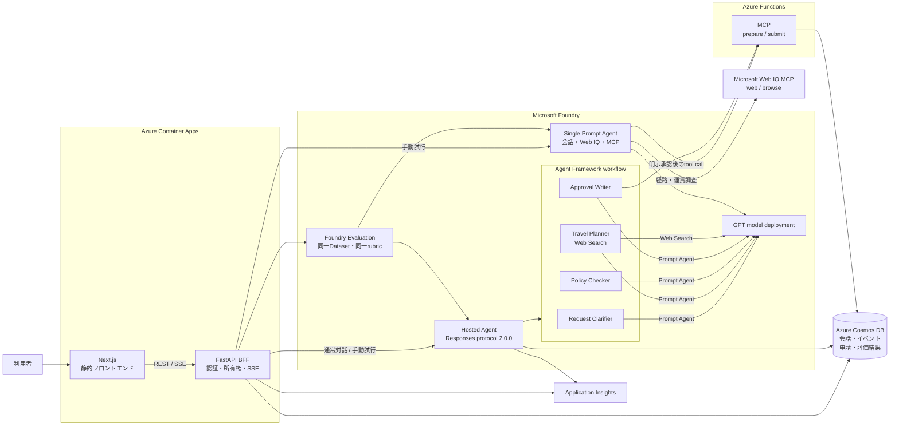
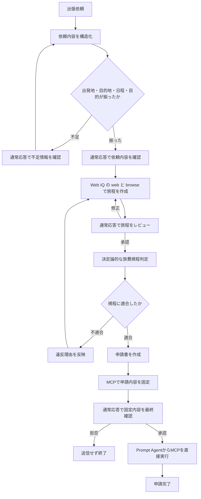

# 出張申請エージェント比較アプリ

自然言語で受け付けた出張依頼を、情報確認、旅程検索、旅費規程チェック、申請書作成、送信まで進めるWebアプリケーションです。通常の対話画面に加え、Agent Frameworkワークフローと単一Prompt Agentの両方を、利用者確認を含む独立した会話として試せる画面を備えています。バッチ評価は詳細検証用の別画面として残しています。

Agent Frameworkシナリオは、**Microsoft Agent Frameworkで定義した1つのワークフロー**としてMicrosoft Foundry Hosted Agent上で実行します。依頼整理、旅程作成、規程説明、申請案作成は、versionを固定した4つのFoundry Prompt Agentが担当します。Single Prompt Agentシナリオでは、1つのPrompt Agentが通常の会話ターンだけで確認、修正、最終承認、MCP申請まで管理します。Azure Container Apps上のFastAPIは、認証、会話所有権、Responses API呼び出し、callbackの透過中継、SSE転送だけを担当し、どちらのシナリオでも業務フローや承認可否を解釈しません。

初めて触る場合は「構成」「処理の流れ」「Azure へデプロイする」まで読んでください。環境変数、テスト、運用上の注意は必要なときに参照できます。

## 5つのPrompt AgentをHosted Agentのワークフローから呼ぶ



| コンポーネント | 実装 | 主な責務 |
|---|---|---|
| Frontend | Next.js 15、React 19 | 2シナリオの対話申請、申請一覧、比較評価 |
| BFF | FastAPI | Entra ID認証、会話所有権、Responses APIとdurable SSEの通信中継、Datasetと評価runの管理 |
| Hosted Agent | Agent Framework、Responses protocol 2.0.0 | 5つのPrompt AgentのオーケストレーションとHITL |
| Prompt Agents | Foundry Agent Service | 専門処理5種と、確認、修正、最終承認、MCP実行を通常会話で管理する単一エージェントシナリオ |
| MCP | Azure Functions | 両シナリオの申請内容固定、利用者回答による承認判定、承認済み申請の冪等な登録 |
| Data | Azure Cosmos DB | 会話、イベント、チェックポイント、承認grant、申請、評価ケースと結果 |
| Observability | OpenTelemetry、Application Insights | BFF と Hosted Agent のトレース |
| Infrastructure | Bicep、Azure Developer CLI | Japan East への一括デプロイと RBAC 設定 |

Hosted Agent 内の名前はチェックポイントとの互換性に関わるため、運用開始後は変更しないでください。

| 種別 | 固定値 |
|---|---|
| Hosted Agent | `travel-request-agent` |
| Workflow | `travel-request-workflow` |
| Prompt Agents | `travel-request-clarifier`、`travel-request-planner`、`travel-request-plan-reviewer`、`travel-request-policy-narrator`、`travel-request-approval-writer` |
| Single Prompt Agent | `travel-request-single-agent` |
| Single Prompt Agent evaluation | `travel-request-single-evaluator` |

Prompt Agentは名前だけでなくversionも設定に保存します。プロンプトやツール定義を変更した場合は新しいversionを作り、Hosted Agentと評価runへ同じversionを渡します。

## 2つのシナリオからHITL申請する

`/`では、1つの自然言語入力から次の2つの申請会話を開始できます。両方を順番に開始することも、片方だけを開始することもできます。

| シナリオ | 実行内容 |
|---|---|
| Agent Framework workflow | Hosted Agent内のワークフローが処理順と会話状態を制御し、5つの専門Prompt Agentと決定論的な規程判定を組み合わせる |
| Single Prompt Agent | 1つのPrompt Agentが通常会話だけで依頼整理、Web IQによる経路・運賃調査、規程判断、申請案作成、確認、修正、最終承認を管理し、承認後にMCPを直接実行する |

両シナリオとも、情報不足の確認、整理した依頼内容の確認、旅程レビューと修正、申請書案の最終確認を画面内で行います。会話はシナリオごとに独立しているため、一方を操作しても他方の状態は変わりません。

両シナリオとも、AgentがMCP `prepare_travel_request_submission`で申請内容を固定してから最終確認へ進みます。最終回答は加工せず`confirmation_text`として`submit_travel_request_with_approval`へ渡し、MCPが明示承認かキャンセルかを判定します。BFFは利用者のメッセージを通常のResponses API入力として送り、Agentのテキスト応答をそのまま中継します。

Single Prompt Agentには`submission`や`playground`などの独自モードはありません。Foundry Playgroundでは通常のチャット文字列だけで会話から申請まで実行できます。Webアプリからは所有者連携のために任意の`conversation_id`を入力へ添えますが、BFF発行トークンは使用しません。

Hosted AgentもFoundry Playgroundから通常のチャットとして直接実行できます。確認、修正、承認はすべてテキスト応答と通常の利用者メッセージで進み、外部クライアントへfunction callを返しません。保存済みチェックポイントからの再開はHosted Agent内部で処理します。

| 画面 | 用途 |
|---|---|
| `/` | 2シナリオのHITL会話とMCP申請 |
| `/playground` | `/`と同じ統合申請画面（旧URL互換） |
| `/requests` | 送信済み申請の確認 |
| `/evaluations` | Datasetを使った詳細なバッチ比較評価 |

## 同じ20ケースで2つの構成を比較する

`/evaluations`では次の2シナリオを同じDatasetで詳細比較します。

| シナリオ | 構成 |
|---|---|
| Agent Framework workflow | Hosted Agentが処理順と状態を管理し、5つのPrompt Agentと決定論的な規程判定を組み合わせる |
| Single Prompt Agent | 1つのPrompt Agentが依頼整理、Web IQによる経路・運賃調査、規程判断、申請案作成までを処理する |

初期ケースは`evaluation-data/travel-request-cases.jsonl`に20件あります。標準的な国内出張、情報不足、規程の境界条件、複雑な経路、相対日付を含みます。画面から追加・編集・複製でき、JSONLも取り込めます。

自動評価はMicrosoft Foundryのバッチ評価を土台にします。旅行申請用rubricを60%、JSON Schema、必須項目、日付、規程、運賃根拠、金額合計の決定論的検証を40%として総合精度を算出します。Foundryの補助指標は総合点に混ぜず、原因分析用に別表示します。

比較画面では総合精度に加え、バッチ所要時間、モデル別トークン量、推定コストを確認できます。推定コストは`app/backend/config/model-pricing.json`の単価を使い、更新日も表示します。単価がないモデルは0円にせず、算出不可として扱います。

人手評価はケースごとに両シナリオを1〜5点で採点し、勝者または引き分けとコメントを保存します。自動評価と人手評価は別に集計するため、rubricでは高得点でも人が読みにくいケースなどを確認できます。

評価モードは申請案の生成で停止します。依頼確認と旅程レビューは自動通過しますが、情報不足は推測せず確認事項を返します。MCP、approval grant、`travel-requests`への書き込みは実行しません。

## Single Prompt Agentだけで会話と申請を管理する



Single Prompt Agentは`request_info`や`mcp_approval_request`を使用しません。依頼確認、旅程レビュー、最終送信確認を通常のアシスタント応答で行い、次の利用者メッセージを`previous_response_id`で同じResponses会話へ渡します。MCPのprepareツールは、申請書、構造化旅程、規程判定を短命approvalへ固定します。Prompt Agentは最終回答を変更せず、`approval_id`と`confirmation_text`をsubmitツールへ渡します。承認可否はMCPが判定します。

受け付けたメッセージも会話ドキュメントに保存し、BFF レプリカが lease を取得して処理します。レプリカが途中で停止した場合は、lease の期限後に別レプリカが残作業を引き継ぎます。

Hosted Agent のチェックポイントも Cosmos DB に保存します。プロセス再起動後に再開できる一方、最後のチェックポイント以降が再実行される可能性があるため、MCP の書き込みは冪等化しています。

## 認証情報と所有権をBFFから副作用まで引き継ぐ

Container Apps の Easy Auth が利用者を Microsoft Entra ID で認証します。FastAPI は `x-ms-client-principal` または署名済み Bearer JWT を検証し、認証済みユーザーの object ID を会話所有者として保存します。

BFF は所有者が一致する場合だけ、会話の取得、メッセージ送信、SSE 接続、申請一覧取得を許可します。リクエスト本文の `user_id` は信頼しません。

Hosted AgentとSingle Prompt Agentは、それぞれのManaged IdentityでMCPへ接続します。prepareツールは会話ドキュメントから認証済み所有者を解決し、申請書、旅程、規程判定、ハッシュ、冪等性キー、有効期限を短命approvalへ固定します。Foundry Playgroundから会話IDなしで呼ばれた場合は、Hosted Agentを`foundry-hosted-agent`、Single Prompt Agentを`foundry-prompt-agent`として区別します。submitツールは、加工前の最終回答、approvalの状態と有効期限を検証し、固定済みデータだけを登録してapprovalを消費済みにします。BFFはapprovalを作成、参照、更新しません。

## リポジトリはBFF、Hosted Agent、MCPを分離している

```text
.
├── app/
│   ├── Dockerfile
│   ├── frontend/                       # Next.js UI
│   └── backend/
│       ├── app/
│       │   ├── auth/entra.py           # Easy Auth / Bearer JWT 検証
│       │   ├── routers/                # conversations、scenarios、stream、travel_requests、evaluations
│       │   └── services/               # Hosted Agent、手動試行、Foundry評価、採点、Cosmos
│       ├── config/                     # rubric とモデル単価
│       └── tests/
├── prompt-agents/                      # 対話・評価を含む6つのPrompt Agent定義
├── evaluation-data/
│   └── travel-request-cases.jsonl      # 初期20ケース
├── hosted-agent/
│   ├── main.py                         # ResponsesHostServer エントリーポイント
│   ├── Dockerfile                      # Hosted Agent、port 8088
│   ├── travel_agent/
│   │   ├── agents.py                   # version固定Prompt Agent接続
│   │   ├── workflow.py                 # Agent Framework グラフ
│   │   ├── executors.py                # HITL、会話判断、評価モード、規程判定、MCP実行
│   │   └── checkpoints.py              # Cosmos チェックポイント
│   └── tests/
├── mcp-tools/
│   ├── function_app.py                 # MCP JSON-RPC エンドポイント
│   ├── tools/submit_travel_request.py  # approval作成、承認判定、冪等登録
│   └── tests/
├── infra/
│   ├── main.bicep
│   └── modules/
├── scripts/
│   ├── deploy-prompt-agents.py         # Prompt Agentの同期
│   ├── validate-evaluation-data.py     # 初期JSONLの検証
│   ├── configure-hosted-agent.sh       # Hosted Agent MI の RBAC と Easy Auth
│   └── smoke-hosted-agent.py
├── azure.yaml                          # Foundry Hosted Agent デプロイ定義
├── deploy.sh                           # ローカル端末からの一括デプロイ
└── .github/workflows/deploy.yml        # GitHub Actions
```

## Azure へデプロイする

### 前提を揃える

- Azure CLI
- Azure Developer CLI（`azd`）
- Python 3.11
- `jq` と `zip`
- Azure サブスクリプションでリソースとロール割り当てを作成できる権限
- Microsoft Foundry Hosted Agent を利用できるサブスクリプション
- Agent Framework が対応する GPT モデルデプロイ

すべての Azure リソースは既定で `japaneast` に作成します。既存の Foundry アカウントは別リージョンへ移せません。旧構成から切り替える場合は、新しいリソースグループへのデプロイを推奨します。

Cosmos DB のパーティションキーも変更できません。旧コンテナーが異なるキーを使っている場合は、新規コンテナーへの移行または再作成が必要です。

### 手元から一括デプロイする

```bash
az login
az account set --subscription <subscription-id>
bash deploy.sh
```

`deploy.sh` は次の順に処理します。

1. BFF と MCP 用の Entra ID アプリ登録を作成または再利用する
2. Bicep で Foundry、Cosmos DB、Functions、Container Apps を構築する
3. 6つのPrompt Agent定義を同期し、確定したversionを保存する
4. MCP Functions、Hosted Agent、BFFを固定versionでデプロイする
5. BFF、Foundryプロジェクト、Hosted AgentのManaged Identityへ必要な権限を設定する
6. 初期20ケースを登録する
7. BFFのhealth checkとHosted Agentの通常チャット応答を確認する

比較評価のスモークテストは通常デプロイでは実行しません。必要な場合だけ、ローカルでは`RUN_EVALUATION_SMOKE=true`、GitHub Actionsでは同名のRepository Variableを`true`に設定して有効化します。

必要に応じて環境変数でデプロイ先を上書きできます。

```bash
AZURE_SUBSCRIPTION_ID=<subscription-id> \
RESOURCE_GROUP=rg-travel-agent-prod \
LOCATION=japaneast \
AZURE_ENV_NAME=travel-agent-prod \
MODEL_DEPLOYMENT_NAME=gpt-5.6-luna \
WEBIQ_API_KEY='<Web IQ API key>' \
bash deploy.sh
```

既存のアプリ登録を使う場合は、`MCP_ENTRA_CLIENT_ID` と `WEB_ENTRA_CLIENT_ID` も指定してください。`WEBIQ_API_KEY`は初回にWeb IQ Project Connectionを作成するときだけ必要です。キーはFoundry Connectionへ保存し、ソース、`.env`、ログへ記録しないでください。既存の`travel-web-iq` Connectionがある場合は、環境変数を省略できます。スクリプトはデプロイ結果をもとに、ルート、`app/backend`、`hosted-agent` の `.env` を生成します。

Single Prompt Agentは、Web IQ MCPの`web`で候補ページを探し、`browse`でNAVITIMEなどの本文を取得してから運賃を確定します。出発時刻が未指定の場合は午前10時ごろを仮定し、旅程レビューに明記します。Web IQは限定アクセスのPreviewで、利用料金が発生します。また、処理内容がAzureのコンプライアンス境界外へ送られる可能性があります。

### GitHub Actions から継続デプロイする

`.github/workflows/deploy.yml` は `main` への push または手動実行で、インフラからスモークテストまで進めます。

OIDC 用の GitHub Secrets:

| Secret | 内容 |
|---|---|
| `AZURE_CLIENT_ID` | GitHub OIDC で使うサービスプリンシパルの client ID |
| `AZURE_TENANT_ID` | Entra tenant ID |
| `AZURE_SUBSCRIPTION_ID` | デプロイ先 subscription ID |
| `WEBIQ_API_KEY` | Web IQ Project Connectionの`x-apikey`。リポジトリ変数ではなくSecretへ保存 |

任意の GitHub Variables:

| Variable | 既定値 |
|---|---|
| `MCP_ENTRA_CLIENT_ID` | MCP Functionsを表すEntraアプリのclient ID。既存secretも後方互換で利用可能 |
| `WEB_ENTRA_CLIENT_ID` | Container Apps Easy Auth用Entraアプリのclient ID。既存secretも後方互換で利用可能 |
| `AZURE_ENV_NAME` | `travel-agent-prod` |
| `AZURE_RESOURCE_GROUP` | `rg-travel-agent-hosted-demo` |
| `AZURE_AI_MODEL_DEPLOYMENT_NAME` | `gpt-5.6-luna` |
| `AZURE_AI_MODEL_CAPACITY` | `1000`（1M TPM） |

GitHub OIDC のサービスプリンシパルには、リソース作成と RBAC 割り当てに加え、BFF 用アプリ登録の redirect URI を更新できる Microsoft Graph 権限または所有権が必要です。

## ローカルでは各プロセスを分けて確認する

依存関係をまとめて入れる場合:

```bash
python -m venv .venv
source .venv/bin/activate
python -m pip install -r requirements-dev.txt
cp .env.sample app/backend/.env
cp hosted-agent/.env.example hosted-agent/.env
```

Windows PowerShell では有効化コマンドを `.venv\Scripts\Activate.ps1` に読み替えてください。

ローカル BFF は Entra 設定が空の場合だけ `dev-user` を使います。BFF の接続先は `app/backend/.env`、Hosted Agent の接続先は `hosted-agent/.env` に設定してください。`EVALUATION_MODE=stub`では会話とSSEイベントがインメモリ保存に切り替わるため、Cosmos DBの権限なしで最終送信確認まで試せます。実際のMCP申請には、Hosted AgentまたはFoundry Project Managed IdentityからMCPへ接続できる設定が必要です。

```bash
# BFF
cd app/backend
uvicorn app.main:app --reload --port 8000

# Frontend
cd app/frontend
npm ci
npm run dev

# Hosted Agent のローカル起動
cd hosted-agent
python main.py
```

Hosted Agent のローカル起動ではインメモリチェックポイントを使います。Foundry 上では `COSMOS_ENDPOINT` が設定されるため、Cosmos DB の永続チェックポイントに切り替わります。

Azureへ接続せず比較画面を確認する場合は、BFFの明示的な評価スタブ設定を有効にします。スタブはローカル専用で、本番では自動的に有効になりません。実際の評価ではPrompt Agentのversion、Dataset version、judge modelが必要です。

初期JSONLは次のコマンドで検証できます。

```bash
python scripts/validate-evaluation-data.py
```

## 変更前に3つのテスト群とFrontendを確認する

```bash
python -m pytest hosted-agent/tests app/backend/tests mcp-tools/tests
python scripts/validate-evaluation-data.py

cd app/frontend
npm ci
npm run build

cd ../..
az bicep build --file infra/main.bicep
azd show
```

Hosted Agent のスモークテストは、デプロイ後の Responses API を直接呼び、確認要求にfunction callが含まれず、通常のチャット返信だけで再開できることを検証します。

```bash
python scripts/smoke-hosted-agent.py \
  --project-endpoint "https://<account>.services.ai.azure.com/api/projects/<project>" \
  --agent-name travel-request-agent
```

## Cosmos DB のコンテナーとキーを固定する

| コンテナー | パーティションキー | 用途 |
|---|---|---|
| `workflow-checkpoints` | `/workflow_name` | Agent Framework のチェックポイント |
| `conversation-events` | `/conversation_id` | durable SSE イベント |
| `conversations` | `/id` | 所有者、シナリオ、Responses ID、処理中メッセージ |
| `approval-grants` | `/id` | 両シナリオでMCPが固定した申請と承認状態 |
| `travel-requests` | `/request_id` | 冪等に登録した申請 |
| `evaluation-cases` | `/dataset_id` | 評価入力、期待値、タグ、版 |
| `evaluation-runs` | `/id` | Datasetと2つのFoundry run、Agent version、集計 |
| `evaluation-results` | `/comparison_id` | ケース単位の両出力、自動評価、人手評価 |

`workflow-checkpoints` は30日で削除します。`approval-grants` はコンテナー側で TTL を有効にし、各アイテムには発行時の短い TTL を設定します。

## 運用で見る場所を分ける

- **Application Insights**: Foundry Hosted Agent のサーバー側トレースと、BFF / Functions の警告・エラー
- **Foundry**: Prompt AgentとHosted Agentのversion、Dataset、Evaluation run、トレース、モデル利用状況
- **Cosmos DB**: イベント再生、MCP approvalの消費状態、申請の重複有無、比較結果
- **Container Apps / Functions**: Easy Auth、Managed Identity、revision と実行ログ

Foundry プロジェクトは Project Managed Identity を使って Application Insights に接続します。プロジェクトの Managed Identity にはトレースの送信・参照に必要なロールを割り当てます。Hosted Agentの再デプロイ後はホスティング基盤がGenAIトレースを自動送信します。プロンプト本文の記録、OpenTelemetryのログ、メトリクス、SDK統計は有効化せず、取り込み量を抑えます。

Foundryでは、確認、修正、MCP実行を応答ターンごとのトレースとして記録します。Agent FrameworkではBFFが同じ会話IDを`agent_session_id`として引き継ぎ、Single Prompt AgentではResponses IDを継続するため、1回の申請に含まれるトレースをまとめて確認できます。

`scripts/configure-hosted-agent.sh`はHosted Agentのデプロイ後に実行します。Hosted AgentにはApplication Insights、Cosmos DB、Foundry Agent Consumerの権限を設定します。Functions Easy AuthはHosted Agent identityとFoundry Project Managed Identityだけを許可し、BFFからの直接MCP呼び出しは許可しません。

## 用語

| 用語 | このリポジトリでの意味 |
|---|---|
| BFF | BrowserからのAPI呼び出しを認証し、Responses APIとSSEを中継するFastAPI |
| Hosted Agent | Foundry がコンテナーを管理し、Responses API として公開する Agent Framework アプリ |
| Prompt Agent | モデル、instructions、toolsをFoundry側のversionとして管理するエージェント |
| HITL | 依頼内容、旅程、送信を利用者が確認してから処理を再開する仕組み |
| approval | MCPが申請内容を固定し、加工前の利用者回答を検証して消費する短命な許可情報 |
| durable SSE | イベントをメモリではなく Cosmos DB に保存し、切断後も `Last-Event-ID` から再送する方式 |
| comparison run | 同じDatasetと評価基準で、2つのエージェント構成を対にして実行した評価単位 |

実装上の問題や改善案は、このリポジトリの GitHub Issues に登録してください。
