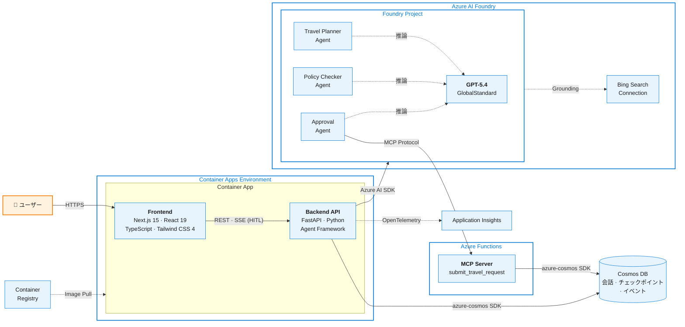
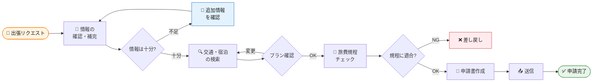
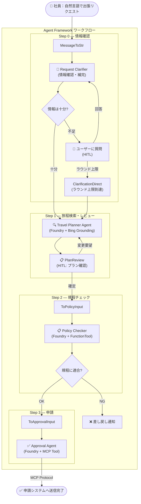

# AI 出張申請エージェント — Microsoft Foundry Demo

社員が「6/12 北海道大学」のように自然言語で伝えるだけで、情報の確認・補完から交通手段・宿泊の検索、社内規程チェック、申請書作成・送信までを一気通貫で処理するワークフロー型マルチエージェント Web アプリケーションです。

---

## 技術スタック



| レイヤー | 技術 | 備考 |
|---|---|---|
| Frontend | Next.js 15, React 19, TypeScript, Tailwind CSS 4 | 静的エクスポート → FastAPI で配信 |
| Backend | FastAPI, Python, Agent Framework | SSE でリアルタイム HITL |
| AI Agent | Azure AI Foundry, GPT-5.4 | 3 Foundry Agent によるワークフロー |
| MCP Tools | Azure Functions, MCP Protocol (JSON-RPC) | 申請登録ツール |
| Data | Cosmos DB | パーティション: `user_id` / `conversation_id` |
| Observability | Application Insights, OpenTelemetry | FastAPI 計装 |
| Infra | Container Apps, Container Registry, Bicep (IaC) | Managed Identity + RBAC |

---

## エージェント構成

**3 つの Foundry Agent + カスタム Executor ノード** によるワークフロー構成です。

| # | ノード名 | 種別 | 役割 |
|---|---------|------|------|
| 0 | **Request Clarifier** | カスタム Executor (HITL) | リクエスト情報の確認・補完（不足時はユーザーに質問） |
| 1 | **Travel Planner Agent** | Foundry Agent + Bing Grounding | 交通手段・宿泊先を検索・提案（構造化 JSON 出力） |
| 2 | **Policy Checker** | Foundry Agent + FunctionTool | 社内旅費規程との適合判定（決定論的ルール） |
| 3 | **Approval Agent** | Foundry Agent + MCP Tool | 出張申請書を作成し、MCP 経由で申請システムへ送信 |

### Travel Planner の構造化出力

```json
{
  "trip_type": "日帰り / 宿泊",
  "transportation_legs": [
    {"method": "新幹線のぞみ 普通車指定席", "from": "東京", "to": "新大阪", "cost": 14720},
    {"method": "新幹線のぞみ 普通車指定席", "from": "新大阪", "to": "東京", "cost": 14720}
  ],
  "transportation_cost": 29440,
  "hotel": "東横INN 大阪本町",
  "hotel_cost_per_night": 8500,
  "hotel_nights": 1,
  "schedule": "4/5 前泊 → 4/6 訪問 → 当日帰京",
  "total_cost": 40440,
  "distance_km": 515,
  "travel_time_hours": 2.5
}
```

---

## 業務プロセスフロー



---

## ワークフロー図（実装）



---

## プロジェクト構成

```
.
├── app/
│   ├── Dockerfile                  # マルチステージ (Node + Python)
│   ├── frontend/                   # Next.js 15 (静的エクスポート)
│   │   └── src/
│   └── backend/                    # FastAPI + Agent Framework
│       └── app/
│           ├── main.py             # エントリーポイント + 静的ファイル配信
│           ├── routers/            # conversations, stream (SSE), travel_requests
│           ├── services/           # cosmos, foundry, mcp_client
│           └── workflow/
│               ├── builder.py      # WorkflowBuilder グラフ定義
│               ├── nodes/          # clarifier, travel_planner, plan_review, submit
│               └── policy.py       # 旅費規程ルールエンジン
├── mcp-tools/                      # Azure Functions MCP Server
│   ├── function_app.py             # MCP JSON-RPC エンドポイント
│   └── tools/                      # submit_travel_request, cosmos_client
├── infra/                          # Bicep IaC
│   ├── main.bicep                  # オーケストレーション
│   └── modules/                    # ai-account, ai-project, cosmos-db, container-apps, ...
├── scripts/
│   └── build_agents.py             # Foundry Agent ビルドスクリプト
├── deploy.sh                       # ワンショットデプロイスクリプト
├── docker-compose.yml              # ローカル開発 (Cosmos エミュレータ付き)
└── .env.sample                     # 環境変数テンプレート
```

---

## 実行方法

### 前提条件

- Python 3.13+, Node.js 22+
- Azure CLI (`az login` 済み)
- Docker (ローカル開発時)

### Azure インフラデプロイ

```bash
# 1. Bicep でインフラ一式をデプロイ（.env が自動生成される）
bash deploy.sh

# 2. Foundry Agent をビルド
python scripts/build_agents.py
```

### ローカル開発

```bash
# Cosmos DB エミュレータ + アプリを起動
docker compose up

# または個別に起動
cd app/frontend && npm install && npm run dev    # http://localhost:3000
cd app/backend  && pip install -r requirements.txt && uvicorn app.main:app --reload  # http://localhost:8000
```

### 本番デプロイ (Container Apps)

```bash
# ACR にイメージをビルド & プッシュ
az acr build --registry <YOUR_ACR> --platform linux/amd64 \
  --image travel-agent:latest ./app

# Container App を更新
az containerapp update --name <APP_NAME> \
  --resource-group <RG> \
  --image <ACR>.azurecr.io/travel-agent:latest
```

### 環境変数

`.env.sample` を `.env` にコピーして設定してください（`deploy.sh` 使用時は自動生成されます）。

```
AZURE_AI_PROJECT_ENDPOINT=https://<account>.services.ai.azure.com/api/projects/<project>
AZURE_AI_MODEL_DEPLOYMENT_NAME=gpt-5.4
BING_CONNECTION_NAME=<account>-bing-grounding
MCP_TOOL_ENDPOINT=https://<function-app>.azurewebsites.net/api/mcp
MCP_FUNCTION_APP_CLIENT_ID=<entra-app-client-id>
APPLICATIONINSIGHTS_CONNECTION_STRING=<connection-string>
```

---

## デモの流れ

### Step 1: 環境紹介
- Foundry ポータルでプロジェクト構成・エージェント一覧を紹介
- Web UI を開き、アーキテクチャを説明

### Step 2: 出張リクエスト & 情報確認
- Web UI から「6/12 北海道大学」のように簡潔に入力
- Request Clarifier が情報を整理し、不足があればチャットで質問

### Step 3: 旅程提案 & プラン確認
- Travel Planner が Bing Grounding で交通手段・宿泊先を検索
- **構造化出力** でプランを提示 → ユーザーが HITL で確認・変更要望

### Step 4: 規程チェック
- Policy Checker が旅費規程をチェック（例: 「宿泊費 ¥8,500 ≤ 上限 ¥12,000 → ✅」）
- **条件分岐エッジ** で OK/NG を自動ルーティング

### Step 5: 申請送信
- Approval Agent が申請書を作成し、MCP 経由で申請システムへ送信

---

## サンプルデータ

### 入力例（自然言語）

**日帰り出張**
```
6/12 北海道大学
```

**宿泊出張**
```
東京から来週の月曜日（4/5）〜火曜日（4/6）に大阪のお客様先（本町駅周辺）を訪問したいです。
目的は新規案件の提案です。
```

### 社内旅費規程

| 項目 | 規程内容 |
|------|---------|
| 宿泊費上限 | ¥12,000/泊 |
| 交通手段 | 新幹線普通車・指定席を原則とする |
| グリーン車 | 乗車時間 3 時間超の場合に限り可 |
| 航空機利用 | 片道 600km 以上、または新幹線より安価な場合に可 |
| 前泊 | 始業時刻に間に合わない場合に認められる |
| 日当 | 国内: ¥2,500 / 海外: ¥5,000 |

---

## 使用する Azure サービス一覧

| サービス | 用途 |
|---------|------|
| Azure AI Foundry (AI Services) | エージェントホスティング・GPT-5.4 モデルデプロイ |
| Bing Search (Grounding) | Travel Planner の検索バックエンド |
| Azure Container Apps | Frontend + Backend の統合ホスティング |
| Azure Container Registry | コンテナイメージ管理 |
| Azure Cosmos DB | 会話メタデータ・チェックポイント・イベント永続化 |
| Azure Functions | MCP Server（申請登録ツール） |
| Application Insights | OpenTelemetry トレース・監視 |
| Microsoft Entra ID | 認証・認可（Managed Identity + RBAC） |

---

## エンタープライズ設計のポイント

### Agent Framework
- **グラフベースのワークフロー**: `WorkflowBuilder` で処理フローを宣言的に定義
- **AI + ルールの融合**: AI Agent と決定論的ロジック（旅費規程）を同一グラフに統合
- **型安全**: Pydantic 構造化出力でエージェント間のデータ受け渡しが堅牢
- **条件分岐エッジ**: ビジネスルールに基づく自動ルーティング

### Human-in-the-Loop
- **SSE + REST**: リアルタイム双方向通信でプランレビュー・情報確認をブラウザ上で実現
- **ワークフローチェックポイント**: Cosmos DB に状態を永続化し、HITL 中断・再開に対応

### ガバナンス & セキュリティ
- **Managed Identity + RBAC**: Container Apps / Functions にシステム割り当て ID、Cosmos DB データ投稿者ロール
- **Entra ID EasyAuth**: MCP Functions への認証付きアクセス
- Policy Checker による**自動コンプライアンスチェック**

### 可観測性
- **OpenTelemetry** ベースで全エージェントの処理フローをトレース
- Application Insights でレイテンシ・コストをモニタリング

### 拡張性
- エージェント追加で機能拡張が容易（例: 経費精算エージェント、海外出張対応エージェント）
- **MCP プロトコル** で外部システム（経費精算・勤怠等）と疎結合に連携
